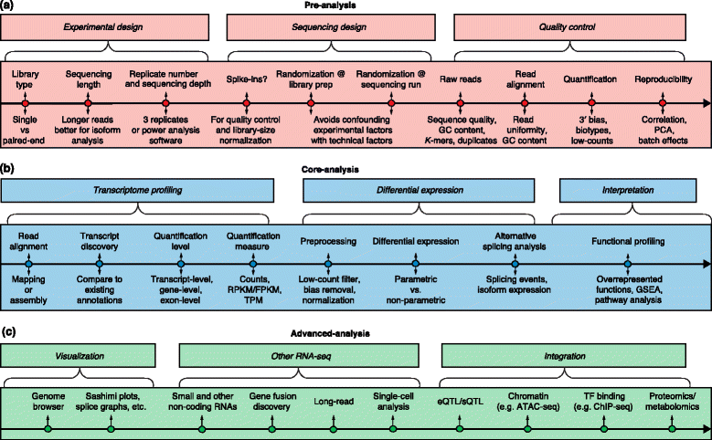

# RNA-seq Overview

```{r, fig.cap='Overview of RNA-seq analysis', out.width='90%', fig.asp=1, fig.align='center', echo=F}

```

### Experimental Design

Experimental design can have a major impact on final results and very much depends on the aims of the experiment and system under investigation. It's therefore impossible to give 'best-practises' guidelines but some general consderations are highlighted below:

* rRNA removal: 
    * rRNA accounts for ~90% of RNA, so needs to be removed - either by poly(A) selection or rRNA depletion
    * Poly(A) requires higher RNA integrity and a larger input amount of RNA
    * rRNA depletion might therefore be preferable for rare/degraded samples, and for looking at ncRNA (& bacterial)
* Novel transcript discovery & differential isoform usage:
    * Strand-specificity is important for differentiating overlapping and antisense transcripts
    * Paired end (PE) and 100bp or longer reads are also recommended
    * Greater sequencing depth
* Differential gene expression:
    * A larger quantity of short SE reads would be preferable if only the differential usage of known genes is being studied
    * If only interested in highly expressed genes, ~5 million (M) reads may be sufficient
    * Up to 100 M may be required for accurate quantification of lowly expressed transcripts
    * For a standard exploratory analysis of DGE I'd personally aim for ~15-30 M reads for a mammalian genome
* Replicate number:
    * Largely depends on biological variability and experimental practices
    * The sequencing procedure itself has minimal impact
    * 3 replicates is the minimum for statistical inference, although many studies still get away with 2
    * Increasing the number of replicates often provides greater statistical power than increasing read depth
