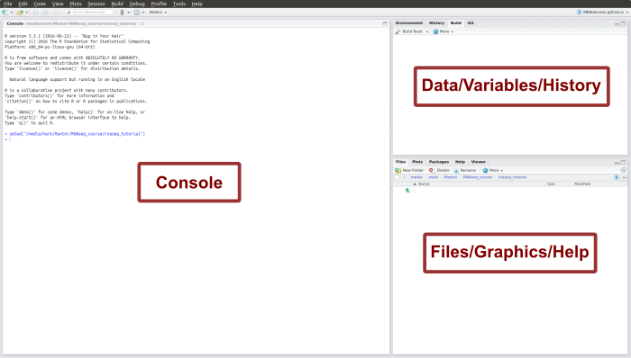

# R basics

To run analyses in R you're going to need to know a few basic concepts about scripting/programming and some simple R commands.

### RStudio Interface

Firstly, open RStudio from your applications. The RStudio interface should look something like this:

```{r, fig.cap='The RStudio interface', out.width='90%', fig.asp=1, fig.align='center', echo=F}

```

Theres three main pane areas here:

* Left: This is the **Console** - the place where you input commands
* Upper right: contains **Environment** and **History** tabs, but you don't need to worry about these just yet.
* Lower right: This pane has a few useful tabs:
    * **Files** : a simple file explorer - lets you see and open files on your system
    * **Plots** : this is where graphics are shown when you create them
    * **Packages** : just a list of available R packages to load
    * **Help** : here you can find helpful documentation on using R

### Working Directory

In the files window, create a new folder for the current analysis and enter it.

The R session has a position in your file system - this is called the **working directory**. This is where all files will be loaded from or saved to by default.

You can change the working directory by going to the **Session** menu -> **Set Working Directory** -> **Choose Directory**. This opens a file browser - choose the new folder we just made.

### Programming languages

Coding is essentially just passing commands to your computer. Commands are written in one of many **programming languages** which can then be translated into a machine-readable format. 

Many programming languages exist and which is best to use depends on the task. Some common languages in bioinformatics are:

* **Bash** : Bash (and other shell scripting languages) are used to interact with the main console/terminal - often refered to as the command line. It's simple and pretty much essential to know to let you perform basic tasks like moving files and running programs at the command line.
* **R** : R is a slightly unusual language as it was developed by statisticians not programmers but this does mean it's well equipped for performing statistical analyses.
* **C** : C was one of the first major programming languages and still one of the most widely used in the programming world, however it's less abstracted than many, and therefore more difficult to write but faster to run. Good for serious algorithm-development but probably less use for the average applied bioinformatician.
* **Python** : Python is a good in between - fast enough to write some of your own quick programs but easy enough to write to use in standard downstream analysis too. Python is one of the most popular languages in bioinformatics.
* **Perl** : similar to python in it's level of abstraction but maybe falling out of fashion a bit.

Here we'll be doing everything in R just to make it easier, but if anyones actually planning on doing their own analyses I'd recommend learning some basic Bash also - I'll add some links to the [resources] page.

### Coding Concepts

There's nothing difficult about coding, but can seem intimidating at first due to the unfamiliar terminology and concepts, so lets just run through a few basic things first.

```{block2, type='rmdimportant'}
Like any language programming languages have grammar rules (called syntax) which need to be followed - capitilisation, commas, brackets etc. all have special meaning and if you add a capital or comma in the wrong place it might stop making sense to the computer and result in an error. So be aware of what you type. 
```

#### Assigning Variables

**Variables** are just objects you can create to hold information - just make up a name and tell it what to hold. The command below creates a variable called freddie and assigns it the value 1. Copy it to your R console and press enter to run it.

```{r, eval=FALSE, message=FALSE, warning=FALSE}
freddie <- 1
```

Now you can recall that value whenever you want by just giving the name:

```{r, eval=FALSE, message=FALSE, warning=FALSE}
freddie
```

```{block2, type='rmdnote'}
R won't like some variable names - it might give you an error if e.g. you try to use a name starting with a number. It's generally best to stick to letters, underscores and periods.
```

The '<-' in the first command is called an **operator** - it's just a symbol that performs a specific function, just like a mathematic operator. In fact you can use most common mathematical operators in R too:

```{r, eval=FALSE, message=FALSE, warning=FALSE}
freddie <- 1 + 1
freddie <- 2 * 5
```

You can use the values stored in variables inside operations:

```{r, eval=FALSE, message=FALSE, warning=FALSE}
freddie <- freddie / 2
```

The stored data doesn't need to be numeric - for instance we could store a list of words:

```{r, eval=FALSE, message=FALSE, warning=FALSE}
my_favourite_reptiles <- list("croc","gator","KOMODO DRAGON!")
```


#### Functions & Arguments

**Functions** are kind of like mini-programs, they're just a pre-defined series of commands run every time you call them. Using functions written by other people makes using R a lot easier - whatever you need to do, someone else has probably already written a function for it!

There's some data pre-existing in R that you can just mess around with to test things out, for instance, lets try looking at some plant data saved in a variable called iris:

```{r, eval=FALSE, message=FALSE, warning=FALSE}
iris
```

This should have printed 150 lines of data to your console, but that's a bit more information than we really wanted. It would be useful to look just at the first few lines, luckily there's a function for that! try using the **head** function:

```{r, eval=FALSE, message=FALSE, warning=FALSE}
head(iris)
```

Sweet! 

There's lots of functions out there but you always call them in the same way - by typing the function name followed by curly brackets/parantheses. 

The things you put inside the brackets are called **arguments** - for instance in the last call to head we gave one argument - the iris object. 

Every function has different arguments, some **required** and some **optional**. To find out what arguments a function wants you can look at the help page for that function by typing a question mark in front of the function name:

```{r, eval=FALSE, message=FALSE, warning=FALSE}
?head
```

You can see from the help page that in addition to the object to look at, there's an 'n' argument to head which lets you control how many rows to print. Lets try it:

```{r, eval=FALSE, message=FALSE, warning=FALSE}
head(iris, n = 10)
head(iris, 15)
```

Note that you can give arguments by name e.g. ```n = 10``` or leave out the name and just give them in the order listed in the help documentation. 