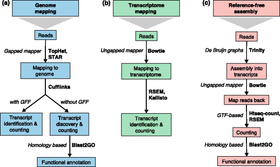

# Read Alignment

```{r, fig.cap='Overview of RNA-seq analysis', out.width='90%', fig.asp=1, fig.align='center', echo=F}

```

There are three main approaches to aligning reads to the genome:

1. Map to the genome: 
    * This is the standard traditional approach 
    * Complicated by the size of the genomes, the millions of reads sequenced & polymorphism
    * Unlike DNA-based sequence techniques RNA-seq also needs to account for splicing
    * Identification of splice sites decreases the accuracy of mapping
    * Allows identification of novel transcripts, mutations and gene fusions
    * Doesn't require 
2. Map to the transcriptome:
    * Reduces amount of sequence you need to search against significantly
    * Eleviates issue of identifying splice sites
    * Much faster
    * Requires well annotated transcriptome
    * Doesn't allow identification of novel transcripts
3. *de novo* transcriptome assembly:
    * Attempts to reconstruct transcripts directly from short reads
    * Doesn't required reference genome/transcriptome

Assuming you're working on a mammalian genome the key determining factor here is probably whether you're interested in novel transcripts, mutations/SNPs or gene fusions. 

If you just want to **quanitify known transcripts** the best choice is likely transcriptome mapping. This is especially true since the development of the new **alignment-independent** algorithms. Alignment-independent or pseudo-alignment algorithms basically determine the transcript a read originates from based on sequence/kmer composition without needing to determine the exact position, making them **extremely fast**. Furthermore, although they're still new and not comprehensively tested, they appear to be [more accurate](https://cgatoxford.wordpress.com/2016/08/17/why-you-should-stop-using-featurecounts-htseq-or-cufflinks2-and-start-using-kallisto-salmon-or-sailfish/) and can normalise for differences in transcript length between samples. The [tximport](http://bioconductor.org/packages/release/bioc/html/tximport.html) package is useful for reading results into R.

Of course you aren't restricted to using one or the other - my recommended approach would be to use a splice-aware alignment tool for transcript-discovery together with an alignment-independent tool for transcript-quantification. My current choice would be [STAR](https://github.com/alexdobin/STAR) together with [Salmon](https://combine-lab.github.io/salmon/). 

The major drawback of STAR is that it requires a LOT of memory - you're probably gonna need >30 Gb of Ram, meaning it's not really an option for many beginners. Another good option might be [HISAT2](http://ccb.jhu.edu/software/hisat2/index.shtml) which largely replaces the popular but slow (and not great) [Tophat2](http://ccb.jhu.edu/software/tophat/index.shtml). 

For a list of commonly used tools see the [resources] section.

### Current Analysis

Unfortunately most of these tools aren't available in R, and you'd need to learn a little bit of shell scripting if you wanted to use them at the command line. For now, we'll use [GSNAP](http://research-pub.gene.com/gmap/) - a splice-aware aligner that has an R-wrapper and performs pretty well [comparative simulations](http://www.nature.com/nmeth/journal/v10/n12/full/nmeth.2722.html).

### Setup

BSgenome packages contain information on whole genomes, SNPs and sometimes masks. This specific package is for Mus musculus mm10 genome. 

```{r, eval=FALSE, message=FALSE, warning=FALSE}
if (!suppressWarnings(require(BSgenome.Mmusculus.UCSC.mm10))) {
  source("http://bioconductor.org/biocLite.R")
  biocLite("BSgenome.Mmusculus.UCSC.mm10")
  library(BSgenome.Mmusculus.UCSC.mm10)
}
```

TxDb packages contain annotation information for specific genome builds and database sources. This specific package is for UCSC knownGene annotations for the Mus musculus mm10 genome. 

```{r, eval=FALSE, message=FALSE, warning=FALSE}
if (!suppressWarnings(require(TxDb.Mmusculus.UCSC.mm10.knownGene))) {
  source("http://bioconductor.org/biocLite.R")
  biocLite("TxDb.Mmusculus.UCSC.mm10.knownGene")
  library(TxDb.Mmusculus.UCSC.mm10.knownGene)
}
```

gmapR is a package to run GSNAP from R.

```{r, eval=FALSE, message=FALSE, warning=FALSE}
if (!suppressWarnings(require(gmapR))) {
  source("http://bioconductor.org/biocLite.R")
  biocLite("gmapR")
  library(gmapR)
}
```

### Creating Genome Index

As with most alignment tools we first need to create an index of the reference genome, for this we're using that mm10 sequence from the BSgenome package.

```{r, eval=FALSE, message=FALSE, warning=FALSE}
mm10_genome <- BSgenome.Mmusculus.UCSC.mm10
```

Normally you would just use this as the genome argument in the indexing but to speed things up we need to get just the sequence of chr10 from the BSgenome object into a usable format. You don't really need to know whats going on here just run the following commands:

```{r, eval=FALSE, message=FALSE, warning=FALSE}
mm10_chr10 <- as(mm10_genome$chr10, "DNAStringSet")
names(mm10_chr10) <- "chr10"
```

Okay now we're ready to create the index using the ```GmapGenome()``` function which takes the following arguments:

* genome = The sequence object to index
* name = a name to save the index as
* create = indicates whether to create a new index

```{r, eval=FALSE, message=FALSE, warning=FALSE}
index <- GmapGenome(genome = mm10_chr10,
                    name = "mm10_chr10",
                    create = TRUE)
```

Next we want known splice-site information to supplement the index with, we'll get this from the knownGene TxDb. First load the txdb object, extract exons with the ```exonsBy()``` accessor function, then filter chromosomes to just get chr10 exons.

```{r, eval=FALSE, message=FALSE, warning=FALSE}
txdb <- TxDb.Mmusculus.UCSC.mm10.knownGene
exons <- exonsBy(txdb)
chr10_exons <- keepSeqlevels(exons, "chr10")
```

We then add this information to the index using the ```spliceSites()``` accessor.

```{r, eval=FALSE, message=FALSE, warning=FALSE}
spliceSites(index, "knownGene") <- chr10_exons
```

Ok all setup, alignment time!

### Aligning Reads

Alignment parameters are set as a simple list then passed to the mapping function.

Most alignment tools have lots of parameters that you can tweak to alter the default behaviour. You can (usually) find documentation for all the options on the tools website. The parameters used here basically just set some penalties for indels and distant splice sites, and tell the tool to look for novel splice sites.

One important consideration when setting stringency is how polymorphic you expect your samples to be compared with the reference transcriptome, obviously mouse samples will normally have much less variation from the reference than human samples.

```{r, eval=FALSE, message=FALSE, warning=FALSE}
 gsnap_param <- GsnapParam(genome = index,
                           novelsplicing = TRUE,
                           splicing = "knownGene",
                           indel_penalty = 1L,
                           distant_splice_penalty = 1L,
                           clip_overlap = TRUE)
```

Then we (would) just run the alignment like so:

```{block2, type='rmdimportant'}
Even with just one chromosome this is still pretty slow (~25m) so rather than run this right now we'll just load some pre-aligned data.
```

```{r, eval=FALSE, message=FALSE, warning=FALSE}
gsnap_output <- gsnap(input_a = fastq_files[[1]],
                      input_b = fastq_files[[2]],
                      params = gsnap_param)
```

### Output

Any alignment-based tools will produce as it's main output a **Sequence Alignment Map (SAM)** file, or it's **binary** equivalent **BAM**. SAM/BAM is the standard format for storing aligned short reads (and increasing unaligned reads too). See the [formats]